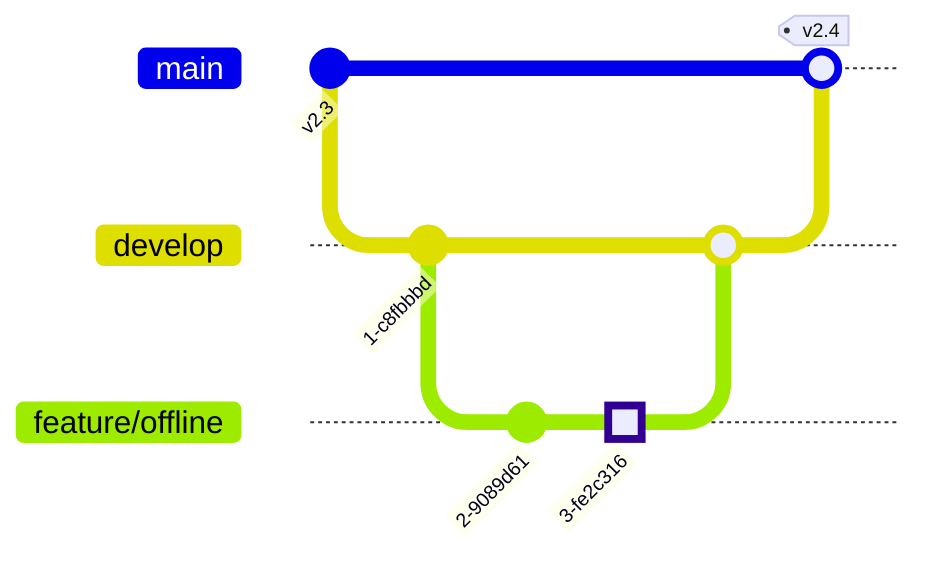
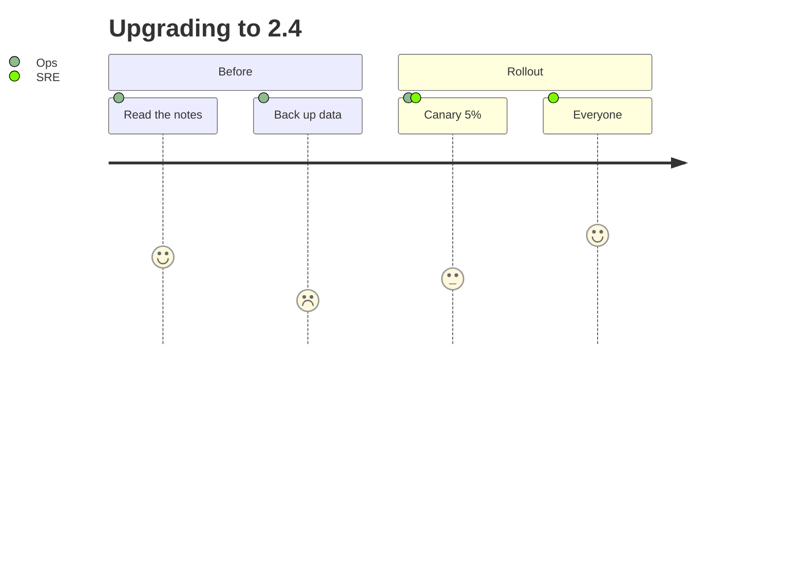

# Release 2.4

```mermaid
gitGraph
    commit id: "v2.3"
    branch develop
    commit msg: "sync engine"
    branch feature/offline
    commit msg: "local cache"
    commit msg: "conflict merge" type: HIGHLIGHT
    checkout develop
    merge feature/offline
    checkout main
    merge develop tag: "v2.4"
```

```mermaid
journey
    title Upgrading to 2.4
    section Before
      Read the notes: 4: Ops
      Back up data: 2: Ops
    section Rollout
      Canary 5%: 3: Ops, SRE
      Everyone: 5: SRE
```
