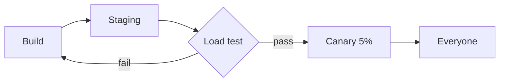

# Release checklist

Shipping **v2.4** of the sync service on Friday. Everything below has to be
green first. Build notes live in `docs/release.md`, and the on-call rota is
on the [team wiki](https://example.com/wiki/oncall).

> [!WARNING]
> The schema change locks the `events` table. Run it outside peak hours.

## Tasks

- [x] Freeze the `main` branch
- [x] Run the load test against staging
- [ ] Rotate the API signing key
- [ ] Post the changelog in #releases

## Latency budget

| Endpoint     | p50   |   p99 | Status |
|:-------------|:-----:|------:|:------:|
| GET /sync    | 12 ms | 48 ms |   ok   |
| POST /push   | 31 ms | 95 ms |   ok   |
| GET /diff    | 54 ms | 210 ms|  slow  |

## Retry logic

```rust
fn backoff(attempt: u32) -> Duration {
    let base = Duration::from_millis(100);
    base * 2u32.pow(attempt.min(6))
}
```

Worst-case wait after $n$ retries is $\sum_{k=0}^{n} 100 \cdot 2^k$ ms.

## Rollout



## After the release

Watch the error budget for 24 hours. If p99 on `/sync` goes over
**100 ms**, roll back first and debug second.
